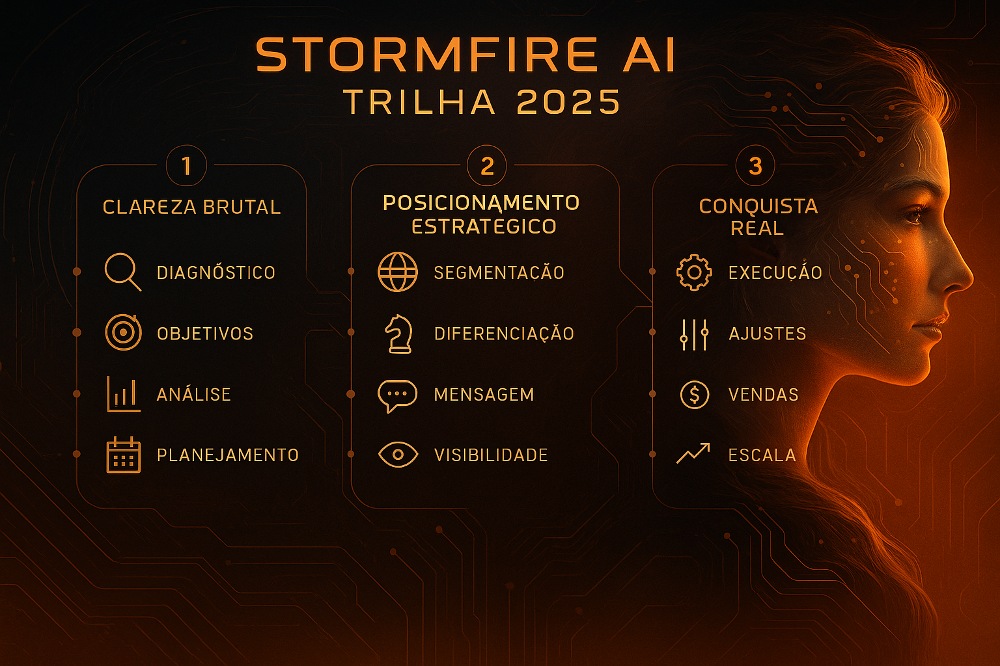

# 🧠 STORMFIRE AI PATH

> 🗣️ *This repository is written in English, but the core visual was designed in Portuguese to reflect the origin and identity of this journey.*

This is not just a repository — it's a digital journey.
It holds my transformation, my learning process, and my voice in the field of Artificial Intelligence.

---

## Who am I?
A Brazilian woman changing careers. 
I graduated during the pandemic and decided to redirect my life towards something I believe in: using AI to build more human, ethical, and impactful solutions.

---

## What is this for?
To organize my learning and share it with others who, like me, are building their path without shortcuts — just intention and curiosity.

---

## Sections

## Sections

- 🔥 [Initial Manifesto](01_intro/mindset.md): Concepts, mindset, and mission
- 🔧 [Essential Tools](02_tools/tools_overview.md): Git, GitHub, Python, Linux, etc.
  - [Git & GitHub](02_tools/git_github.md)
  - [Python](02_tools/python.md)
  - [Linux](02_tools/linux.md)
  - [VS Code](02_tools/vscode.md)
- 🧠 Practical AI Projects
- 📚 [Resources](04_resources/resources_overview.md) (courses, books, articles)
   ### 📄 Articles Available

   - **🧠 Who is in control of the Artificial Intelligence?**  
     ↳ [🇧🇷 Read in Portuguese](04_resources/controle.ai/pt.md)  
     ↳ [🇬🇧 Read in English](04_resources/controle.ai/en.md)
- 🧭 Public presentation and portfolio

---

> This is not just about learning.
> It’s about becoming someone capable of shaping the future.

And if you're reading this — maybe it's time for you to start too.
